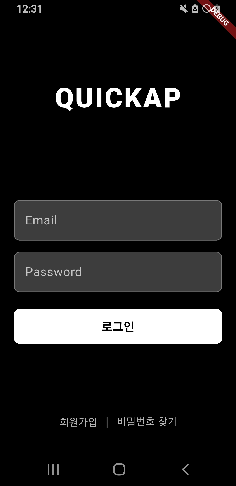
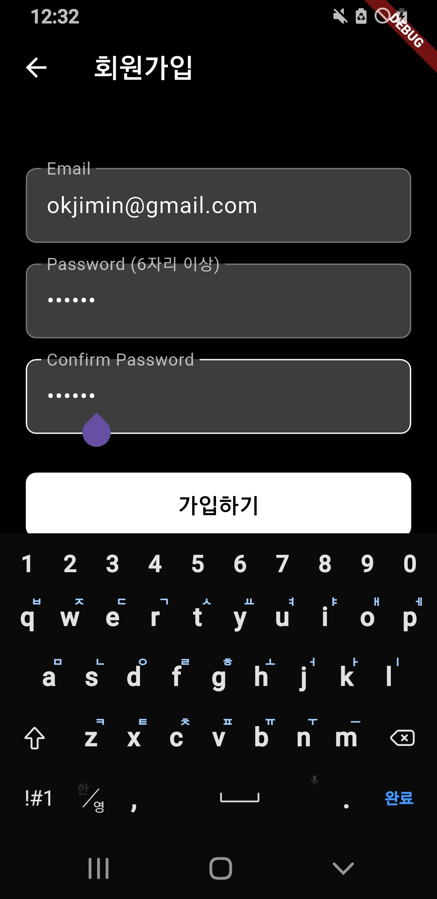
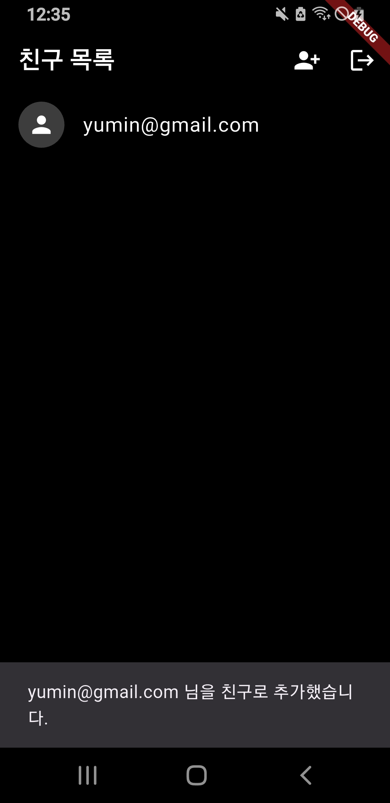
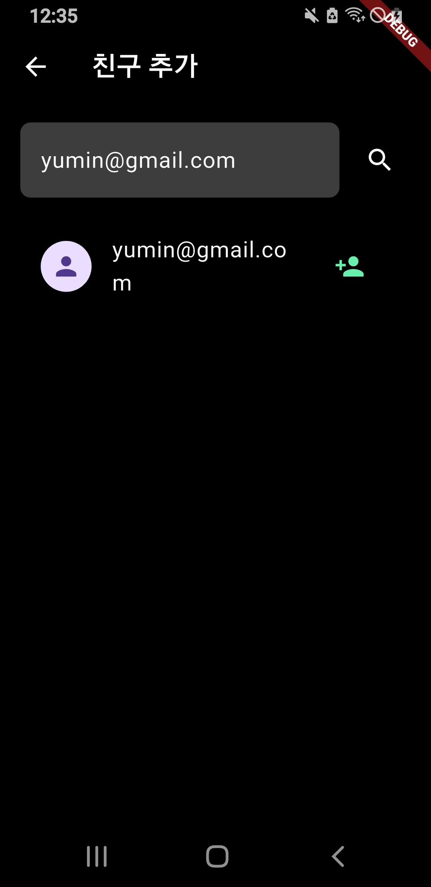
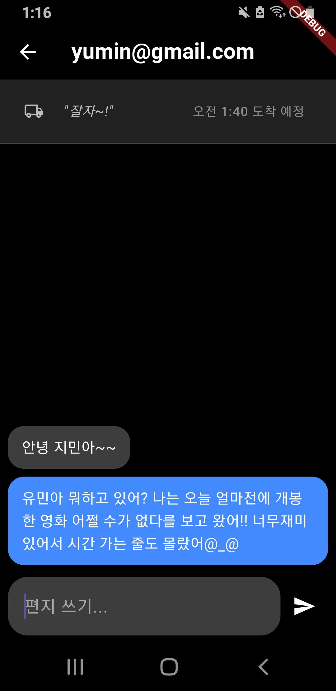
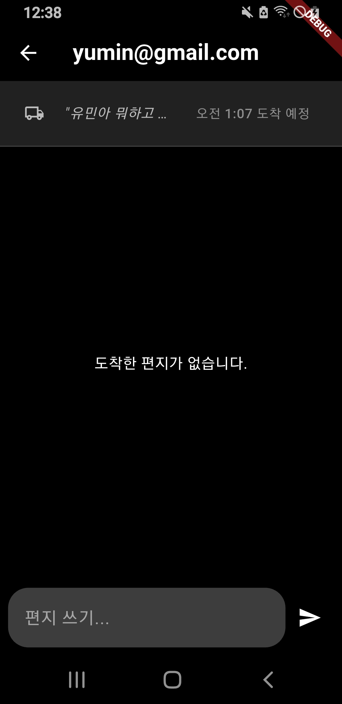

### 📮 quickap

**"느린 것이 가장 빠른 것이다."** 과잉 연결 시대에 지친 당신을 위한, **기다림의 메신저 – quickap**

 

<table align="center">
  <tr>
    <td align="center"><b>로그인</b></td>
    <td align="center"><b>회원가입</b></td>
    <td align="center"><b>친구 목록</b></td>
  </tr>
  <tr>
    <td></td>
    <td></td>
    <td></td>
  </tr>
  <tr>
    <td align="center"><b>친구 추가</b></td>
    <td align="center"><b>채팅방</b></td>
    <td align="center"><b>전송 대기 메시지</b></td>
  </tr>
  <tr>
    <td></td>
    <td></td>
    <td></td>
  </tr>
</table>

---

### 💡 개발 동기 (Motivation)

21세기 현대 사회는 과도한 연결성으로 인해 끊임없는 실시간 소통을 강요받고 있습니다. 우리는 항상 즉시 연결되어야 한다는 압박 속에서, 생각할 틈 없이 빠르게 메시지를 주고받는 데 익숙해졌습니다.

**quickap**은 이러한 문제의식에서 출발했습니다. 빠른 대화 속에서 놓치기 쉬운 '진심'을 되찾고자, 편지처럼 느리게 도착하는 메시지를 통해 **신중하고 의미 있는 소통이 가능한 공간**을 제공합니다. 사용자는 의도된 기다림을 통해 메시지 하나하나에 더 깊은 생각과 진심을 담을 수 있습니다.

> "느리고 신중하게 보낸 메시지가 더 큰 울림을 준다."

이 프로젝트는 기술을 통해 소통의 '속도'가 아닌 '깊이'를 추구함으로써, 디지털 환경에서의 긍정적인 사회적 상호작용과 건강한 소통 문화를 만드는 데 기여하고자 합니다.

---

### ✨ 주요 기능 (Features)

* **Firebase Authentication 기반 회원가입 및 로그인**
    * 이메일과 비밀번호로 간편하게 계정을 생성하고 안전하게 로그인할 수 있습니다.

* **느린 배송 시스템**
    * 메시지 전송 시 배송 속도를 선택하여 의도적으로 지연된 소통을당

 

*이 프로젝트는 2025 인하대학교 오픈소스SW 페스티벌 출품작입니다.*
